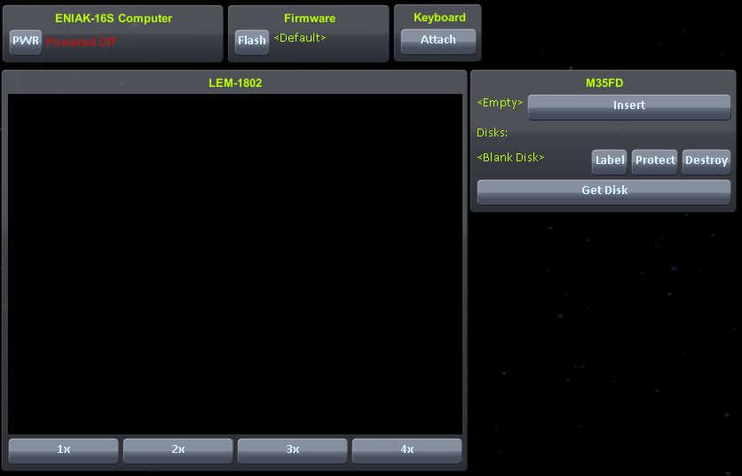

Ketchup
===========

**Ketchup** is a mod for [Kerbal Space Program][ksp] which implements a programmable CPU and associated devices.

Description
---------------
The CPU is an implementation of the [DCPU-16][dcpu] [spec][dcpu-spec], originally designed by
[Markus "Notch" Persson][notch] for the game [0x10c][0x10c]. Emulation of the CPU is provided by the
[Tomato][tomato] library. Implementations of the [monitor][monitor-spec], [keyboard][keyboard-spec],
[clock][clock-spec], and [floppy drive][floppy-spec] deivces are also provided.

Ketchup is currently in the alpha stage, with *many* features and improvements to be made. Most notably, there
currently exist no devices capable of interacting with the vessel, so using the CPU for flight control is not
currently possible. However, any program written for the DCPU-16 should be able to run within Kerbal Space
Program.

Releases
------------
Release information and downloads may be found on the GitHub [releases][releases] page.

Building
------------
In order to build Ketchup two assemblies are required from your Kerbal Space Program installation. Because there
are no obvious distribution licenses for these libraries, they cannot be commited to source control.

1. Make a `KSP` directory under the `Dependencies` directory.
2. From the `KSP_Data/Managed` directory under your Kerbal Space Program installation, copy the following files to
   the previously created directory: `Assembly-CSharp.dll` and `UnityEngine.dll`.
3. Execute `msbuild` (.NET) or `xbuild` (Mono) to build.

You must use the `Tomato.dll` found in the `Dependencies` directory, as it is modified to be usable by Kerbal
Space Program. Or you may build your own copy from the `ksp-compat` [branch][tomato-ksp-compat] of my Tomato fork.

Installation
----------------
If you built from source, navigate to the `Output/Debug` or `Output/Release` directory depending on the
configuration of your build. Copy the entire `Ketchup` directory to the `GameData` directory in your Kerbal Space
Program installation.

If you are installing from a pre-packaged distribution, simply extract the `Ketchup` directory to the `GameData`
directory in your Kerbal Space Program installation.

Usage
---------
Two new parts will appear in game under the "Pods" section of the craft editor: the *ENIAK-16S Computer* and the
*ENIAK-16L Computer*, these "Mechanical Kerbal Brains" replace the *RC-001S Remote Guidance Unit* and the
*RC-L01 Remote Guidance Unit* respectively. The computers will consume twice as much electricity as a remote
guidance unit however. Construct a rocket normally with one of the new parts.

When you're reading to launch, right click on the computer part to bring up its context menu. Among the usual
options will be several options to toggle the interface of several devices. Toggle each of them on.

### Computer
The computer window allows you to control power to the computer via the **PWR** button, it also displays if the
computer is powered off, is halted, or is running by showing the average clock speed.

### Firmware
The firmware window allows you to flash the built-in firmware/bios. The firmware contains the first code that is
executed by the CPU when it powers on an is usually used to bootstrap the computer from other media. The firmware
device comes preloaded with a default firmware which will search for a floppy drive and load the first sector
(512 words) from the floppy into memory and execute it. If the program on the floppy disk is longer than 512 words
additional bootstrap code would be required to load additonal sectors into memory. Alternatively, a custom
firmware may be used to load additional sectors into memory. One such firmware, `firmware_127sectors_v1.dasm`, is
provided in the `Contrib/Firmware` directory of the distribution. As its name suggests, it automatically reads the
first 127 sectors (65024 words) from the floppy disk into memory. This actually, takes some time, so do not be
alarmed if your program takes some time to load. To use this firmware, first assemble it into a big-endian binary
image using a DCPU-16 assembler, such as [Organic][organic]. Then create a directory:
`Kerbal Space Program/saves/<profilename>/Ketchup/Firmware` under your Kerbal Space Program installation path.
Now, when you press the **Flash** button in the firmware window, you should be given the option to use the
custom firmware.

### Keyboard
The keyboard window contains a single button, **Attach**, which when enabled sends your keyboard input to the
computer.

### LEM-1802
The LEM-1802 window displays the standard monitor. The monitor's resolution of 128x96 pixels might be very small, 
so the buttons at the bottom allow you to change the scaling of the display.

### M35FD
The M35FD window allows you to interact with the M35FD floppy drive. Each vessels maintains its own copies of
floppy disks, but you may retrieve standard floppy disks via the **Get Disk** button. The **Get Disk** button will
always give you the option to retrieve a blank disk, but it will also list any floppy disk images you have in
`Kerbal Space Program/saves/<profilename>/Ketchup/FloppyDisks`. Image files may end in `.bin` or `.img`. Standard
object code generated by a DCPU-16 assembler may be used as a floppy disk image. See the previous discussion under
*Firmware* for how to load programs larger than a single sector.

Once you have retrieved a list, it will be listed under the vessel's available disks. At this point you have three
options to manipulate the disk, you can use the **Label** button to change the label of the disk, the **Protect**
button to enable write protection on the disk, and **Destroy** to destroy the disk forever. If the M35FD is empty
you may press the **Insert** button, at which point you may select an available disk to insert into the drive.
When inserted, the disk's label will be displayed and you then have the option to press the **Eject** button to
eject it.

### Time Warp Note

When a computer is powered on on a vessel, time warp is limited to 4x. Computers have a clock speed of 100KHz,
relative to game time (up to 400KHz relative to real time).

Issues
----------
Please check the GitHub [issue tracker][issues] for a list of all current issues (bugs or enhancements).

Name
--------
*Ketchup* is derived predominantly from the Tomato project, and its name begins with a *K* so... yeah.

[0x10c]: http://0x10c.com/
[clock-spec]: http://dcpu.com/clock/
[dcpu]: http://dcpu.com/
[dcpu-spec]: http://dcpu.com/dcpu-16/
[floppy-spec]: http://dcpu.com/floppy-drive/
[issues]: https://github.com/dbent/Ketchup/issues
[keyboard-spec]: http://dcpu.com/keyboard/
[ksp]: https://kerbalspaceprogram.com/
[monitor-spec]: http://dcpu.com/monitor/
[notch]: https://mojang.com/notch/
[organic]: https://github.com/SirCmpwn/organic
[releases]: https://github.com/dbent/Ketchup/releases
[tomato]: https://github.com/SirCmpwn/Tomato
[tomato-ksp-compat]: https://github.com/dbent/Tomato/tree/ksp-compat
